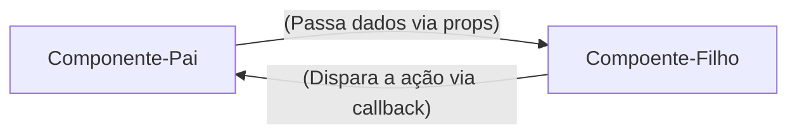

# Programação Front-End 2

## Angular

O framework Angular é uma plataforma para construção de aplicações web. Ele permite criar aplicações de página única (SPA) com uma arquitetura baseada em componentes, facilitando a manutenção e escalabilidade do código.

### História

O Angular foi desenvolvido pelo Google e lançado em 2010 como AngularJS. Em 2016, o Angular 2 foi lançado, trazendo uma reescrita completa do framework com foco em desempenho e modularidade. Desde então, o Angular tem evoluído continuamente, com versões regulares que introduzem novos recursos e melhorias.

O Angular utiliza TypeScript como linguagem principal, o que proporciona tipagem estática e recursos avançados de desenvolvimento. Ele também oferece um sistema de injeção de dependência, roteamento, formulários reativos e muito mais.

### Estrutura de um Projeto Angular

- `src/`: Diretório principal do código-fonte.
  - `app/`: Contém os componentes, serviços e módulos da aplicação.
  - `assets/`: Armazena arquivos estáticos como imagens e estilos.
  - `environments/`: Configurações de ambiente para desenvolvimento e produção.

### Componentes

Componentes são blocos reutilizáveis de código que encapsulam a lógica, o template e o estilo de uma parte da interface do usuário. Cada componente é definido por um arquivo TypeScript, um arquivo HTML e um arquivo CSS.

#### Exemplo de Componente

```typescript
import { Component } from '@angular/core';

@Component({
  selector: 'app-example',
  templateUrl: './example.component.html',
  styleUrls: ['./example.component.css']
})
export class ExampleComponent {
  // Lógica do componente
}
```

### Serviços

Serviços são classes que fornecem funcionalidades compartilhadas entre diferentes componentes. Eles são usados para gerenciar dados, fazer chamadas HTTP e encapsular lógica de negócios.

#### Exemplo de Serviço

```typescript
import { Injectable } from '@angular/core';

@Injectable({
  providedIn: 'root'
})
export class ExampleService {
  // Lógica do serviço
}
```

### Módulos

Módulos são contêineres que agrupam componentes, serviços e outros módulos relacionados. O módulo principal da aplicação é o `AppModule`, que é definido no arquivo `app.module.ts`.

#### Exemplo de Módulo

```typescript
import { NgModule } from '@angular/core';
import { BrowserModule } from '@angular/platform-browser';
import { AppComponent } from './app.component';

@NgModule({
  declarations: [
    AppComponent,
    // Outros componentes
  ],
  imports: [
    BrowserModule,
    // Outros módulos
  ],
  providers: [],
  bootstrap: [AppComponent]
})

export class AppModule { }
```

## React

O React é uma biblioteca JavaScript para construção de interfaces de usuário. Ele permite criar componentes reutilizáveis e gerenciar o estado da aplicação de forma eficiente.

### História

O React foi desenvolvido pelo Facebook e lançado em 2013. Ele introduziu o conceito de Virtual DOM, que melhora o desempenho da atualização da interface do usuário. O React é amplamente utilizado para construir aplicações web modernas e é conhecido por sua simplicidade e flexibilidade.

### Estrutura de um Projeto React

- `src/`: Diretório principal do código-fonte.
  - `components/`: Contém os componentes da aplicação.
  - `services/`: Armazena serviços e lógica de negócios.
  - `App.js`: Componente principal da aplicação.

### Componentes

Componentes no React são funções ou classes que retornam elementos JSX, que descrevem a interface do usuário. Eles podem receber propriedades (props) e gerenciar seu próprio estado.

#### Exemplo de Componente Funcional

```javascript
import React from 'react';

function ExampleComponent(props) {
  return (
    <div>
      <h1>{props.title}</h1>
      <p>{props.description}</p>
    </div>
  );
}
```

### Guia Rápido e Anotações

**Unidade Curricular:** Desenvolvimento Front-end
**Conteúdo:** Desenvolvimento com Framework - React

#### Semana 1 - Introdução ao React e Ambiente de Desenvolvimento

##### 1. O que é React 

Uma biblioteca Javascript (React.js) para criação de interfaces de usuário (UI)

Funciona de forma **declarativa**: Você descreve o resultado esperado com base nos dados, e o React atualiza o navegador

Cria *SPAs* (Single Page Applications): Atualiza partes da tela sem recarregar a página inteira.

##### 2. React vs Javascript Vanilla: Virtual DOM x Tradicional

O DOM no JS Vanilla é imperativo: Procura a tag, muda o componente e atualiza a página 

React(Declarativo): UI = Componente(dados) -> Quando os dados mudam, o React atualiza o componente.

##### 3. Comandos Essenciais no Terminal

```bash
# Criar projeto com Vite
npm create vite@latest <nome_projeto> -- --template react

# Atualizar e instalar dependências do projeto (node_modules)
npm install 

# Iniciar o servidor local (http:localhost:5173)
npm run dev
```

##### 4. Sintaxe do primeiro componente JSX(Javascript com Marcação HTML)

```jsx
  //src/App.js
  // COmponente raíz da aplicação
  function App() {
    const Sistema = "Meu Site";

    return (
      <main>
        <h1>{sistema}</h1>
        <p>Gerencie seus componentes em um só lugar</p>
      </main>
    );
  }

  export default App
```

> OBS.: O JSX exige **uma única tag raíz** (ou fragmento <> ... </>) e nome de componentes sempre começam com a letra maiúscula (UpperCamelCase)

#### Semana 2 - JSX, Components, Props e Events

##### 1. Responsabilidade Única (SOLID)

Quebrar a tela em componentes pequenos. Cada componente deve fazer apenas uma única coisa bem feita

**Exemplo de componentes**:
- `Header`: Cuida do título e do cabeçalho da aplicação
- `Footer`: Cuida do rodapé da aplicação 
- `NavBar`: Cuida da barra de navegação do site

> OBS.: O princípio do SOLID estabelece que uma unidade de software deve ter apenas um motivo para mudar

##### 2. Props: Passagem de dados e fluxo unidirecional

**O que são Props**? 

Os props são argumentos ou parâmetros das funções já que um componente React é uma função Javascript, ou seja, as props (abreviação de properties) permitem que o compoentne pai envie dados dinâmicamente para o componente filho, tornando-o customizável e reutilizável

##### 3. Eventos e Comunicação via Callbacks

React encapsulamento de eventos nativos em objetos, a diferença do react para o HTML é a sintaxe
- no HTML : `onclick="minhaFuncao()"`
- no React JSX : `onClick={minhaFuncao}`

> Funções em Javascript deve seguir o padrão lowerCamelCase de escrita.



##### 4. Listas Dinâmicas com map() e a propriedade `key`

**Por que arrays são estruturas padrão do front-end?**

Os dados chegam a partir DB e APIs no formato de coleção (JSON)

o método `.map()` percorre cada item de um array e retorna um novo componente JSX

Exemplo:

```jsx
tarefas.map((e) => (
    <TarefaItem
      key={e.id}
      id={e.id}
      titulo={e.titulo}
      descricao={e.descricao}
      concluido={e.concluido}
    />
))
```
**Por que o React exige o `key` no uso do .map()?**

O React precisa saber de forma inequívoca qual item específico foi adicionado, alterado ou removido quando renderiza uma lista. Se a chave for omitida, o react emite um aviso no console: `Warning: Each child in a list should have a unique "key" prop.`

> Evitar o índice do array como chave `(key={index})` : índice do vetor não é fixo, use sempre uma chave única para os itens da lista (carimbo de data e hora, id único)

##### Componentes de Formulário Estático

Criando o arquivo `TarefaForm.jsx`
